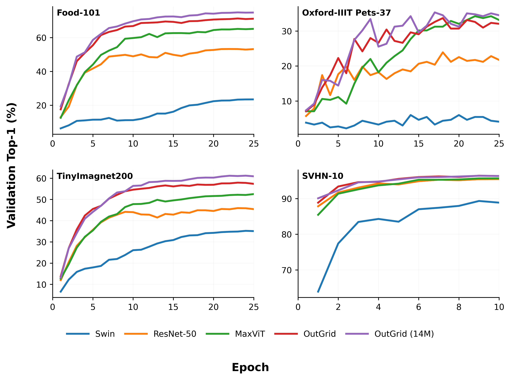
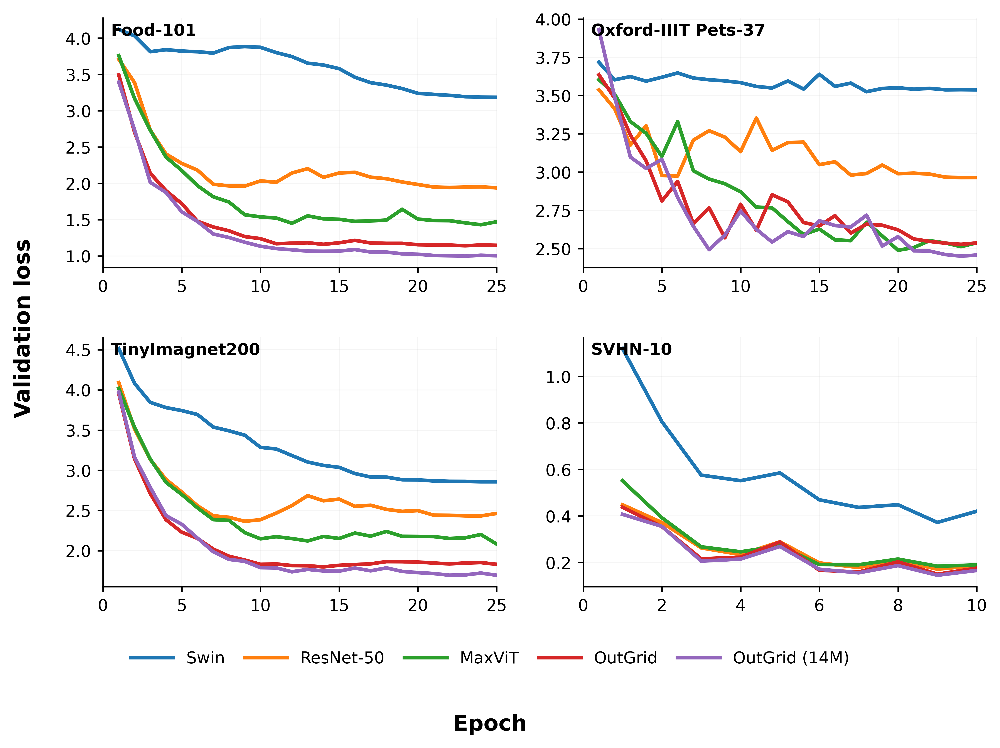

# OutGridViT: Outlook-Grid Vision Transformer


OutGridViT is a research-focused hybrid vision architecture that fuses **Outlooker** local attention (VOLO-style), **MBConv** inductive bias, and **Grid Attention** (MaxViT-style). The core design is Model A, where *every block* injects dynamic local aggregation before global mixing.

This repo contains the full training stack, ablations, baseline comparisons, and analysis tools (MAD metrics + attention visualizations).

## Table of Contents

- [Model A (Main Architecture)](#model-a-main-architecture)
- [Block Forward (tensor form)](#block-forward-tensor-form)
- [Model Forward (high level)](#model-forward-high-level)
- [Visual Experiments](#visual-experiments)
- [Reported Results](#reported-results)
- [Convergence Curves (CIFAR-100, 32x32)](#convergence-curves-cifar-100-32x32)
- [Model Comparisons (CIFAR-100, 32x32)](#model-comparisons-cifar-100-32x32)
- [Robustness on TinyImageNet-C](#robustness-on-tinyimagenet-c)
- [MAD + Entropy Metrics (Grid vs Outlooker)](#mad--entropy-metrics-grid-vs-outlooker)
- [Baseline Training Recipe](#baseline-training-recipe)
- [Configs](#configs)
- [Training (Model A)](#training-model-a)
- [Baseline Comparisons (CIFAR-32)](#baseline-comparisons-cifar-32)
- [Attention Analysis and MAD Metrics](#attention-analysis-and-mad-metrics)
- [Project Structure](#project-structure)
- [Conclusion](#conclusion)
- [Notes](#notes)
- [Citation](#citation)

## Model A (Main Architecture)

**Block composition (OutGridBlock):**
`Outlooker -> MBConv -> GridAttn -> MLP`

Input/output stays in 2D feature maps (NCHW). Only the GridAttn path temporarily uses BHWC and tokenized grids.

## Block Forward (tensor form)

Input: `x in R^{B x C x H x W}`

$$
\begin{aligned}
 x_1 &= \mathrm{Outlooker}(x) \\ 
 x_2 &= \mathrm{MBConv}(x_1) \\ 
 \hat{x}_2 &= \mathrm{permute}(x_2) \\ 
 y &= \hat{x}_2 + \mathrm{DP}(\mathrm{GridAttn}(\mathrm{LN}(\hat{x}_2))) \\ 
 z &= y + \mathrm{DP}(\mathrm{MLP}(\mathrm{LN}(y))) \\ 
 \mathrm{OutGridBlock}(x) &= \mathrm{permute}^{-1}(z)
\end{aligned}
$$

`DP` is stochastic depth. `LN` is LayerNorm in BHWC.

## Model Forward (high level)

$$
\begin{aligned}
 x_0 &= \mathrm{Stem}(x) \\ 
 x_{s,i+1} &= \mathrm{OutGridBlock}(x_{s,i}), \quad i=0..(d_s-1) \\ 
 x_{s+1,0} &= \mathrm{Downsample}_s(x_{s,d_s}) \\ 
 \mathrm{logits} &= \mathrm{Linear}(\mathrm{GAP}(\mathrm{BN}(x_{S,d_S})))
\end{aligned}
$$

## Visual Experiments

Outlooker behaves like a **dynamic 3x3 kernel** per position, while Grid Attention provides more global mixing per block. Below are sample overlays produced by the analysis pipeline.

Outlooker locality (kernel weights + center/spread overlays):


More Outlooker examples (different stages/blocks):

| Example A | Example B |
| --- | --- |
|  |  |
|  |  |

Grid attention heatmap (query overlays over the input):


More Grid Attention examples (different stages/blocks):

| Example A | Example B |
| --- | --- |
|  |  |
|  |  |


## Reported Results

<div align="center">


| Dataset | Img size | Top-1 (val/test) | Params | Notes |
| :---: | :---: | :---: | :---: | :---: |
| CIFAR-100 | 32 | - / 79.72 | 7.5M | Model A (7M), 100 epochs |
| CIFAR-100 | 64 | 78.7 / 81.2 | ~14M | Upsampled CIFAR-100 |
| Tiny-ImageNet-200 | 64 | 66.5 / 69.8 | 22.5M | Competitive for 22M params |
| SVHN | 32 | 96.1 / - | ~14M | Val reported in logs |

</div>

<br>


## Convergence Curves (CIFAR-100, 32x32)

<div align="center">





</div>

<br>

## Model Comparisons (CIFAR-100, 32x32)

<div align="center">

All baselines below were trained with the same recipe. Values are from `logs/Logs Models Comparisons Cifrar100 100epocs.txt`.

| Model | Top-1 | Params | FLOPs (per forward) | Throughput (imgs/s) |
| :--- | :---: | :---: | :---: | :---: |
| **OutGridViT (Model A, 7M)** | **79.72** | **7.52M** | **448 MFLOPs** | **1131.8** |
| ConvNeXt-Tiny | 72.60 | 27.89M | 364 MFLOPs | 1832.8 |
| DeiT-Tiny (patch4) | 63.77 | 5.38M | 347 MFLOPs | 5077.2 |
| DeiT-Small (patch4) | 59.00 | 21.38M | 1.38 GFLOPs | 3432.9 |
| EfficientNetV2-S | 64.62 | 20.31M | 238 MFLOPs | 2099.3 |
| MaxViT-Nano (surgery) | 75.41 | 17.38M | 305 MFLOPs | 1253.9 |
| MaxViT-Tiny | 75.90 | 30.43M | 444 MFLOPs | 980.4 |
| ResNet18 (CIFAR stem) | 73.25 | 11.22M | 557 MFLOPs | 5393.2 |
| ResNet50 (CIFAR stem) | 77.42 | 23.71M | 1.30 GFLOPs | 1918.7 |
| Swin-Tiny (patch2) | 59.89 | 27.57M | 358 MFLOPs | 3360.6 |

*Throughput is hardware-dependent; use it for relative comparison only.*

</div>

## Robustness on TinyImageNet-C

<div align="center">

Robustness evaluation (mean top-1 across corruptions; higher is better). Full logs in `logs/Logs Models Convergance on TinyImagnet-C.txt`.

| Model | Params | GFLOPs | Clean Top-1 | Overall Mean Top-1 |
| :--- | :---: | :---: | :---: | :---: |
| **OutGridViT (Model A)** | **6.26M** | **1.56** | **57.81** | **26.59** |
| ResNet50 | 23.91M | 1.31 | 45.31 | 16.52 |
| Swin-Tiny | 27.65M | 1.47 | 35.00 | 12.27 |
| MaxViT-Tiny | 30.48M | 1.77 | 53.11 | 22.03 |

</div>

## MAD + Entropy Metrics (Grid vs Outlooker)

<div align="center">

Quantitative summary (CIFAR-100, Model A). `GRID_abs` is L1 distance in feature-map pixels, max `(Hf-1)+(Wf-1)` per stage. `OUT_abs` is L1 distance inside a 3x3 kernel, max = 2. `Hn` is normalized entropy in [0, 1].

| Stage | Hf x Wf | GRID_abs | OUT_abs | GRID_Hn | OUT_Hn |
| :---: | :---: | :---: | :---: | :---: | :---: |
| 0 | 64 x 64 | 31.79 ± 1.13 | 1.33 ± 0.13 | 0.818 ± 0.037 | 0.894 ± 0.005 |
| 1 | 32 x 32 | 15.41 ± 0.15 | 1.66 ± 0.12 | 0.915 ± 0.013 | 0.868 ± 0.042 |
| 2 | 16 x 16 | 7.89 ± 0.18 | 1.67 ± 0.24 | 0.943 ± 0.011 | 0.850 ± 0.046 |
| 3 | 8 x 8 | 4.48 ± 0.33 | 1.73 ± 0.14 | 0.801 ± 0.054 | 0.814 ± 0.076 |

*Interpretation: Outlooker stays strictly local, while Grid attention spreads wider and is more entropic in mid stages (1-2).*
*Numbers from `experiments_results/Cuantitaive Experiments/mad_entropy.ipynb`.*

</div>

## Baseline Training Recipe

All baseline models use the same training config:

```python
history, model = train_model(
    model=model,
    train_loader=train_loader,
    epochs=100,
    val_loader=val_loader,
    device=device,

    lr=5e-4,
    weight_decay=0.05,

    autocast_dtype="fp16" if device == "cuda" else "fp32",
    use_amp=(device == "cuda"),
    grad_clip_norm=1.0,

    warmup_ratio=0.05,
    min_lr=1e-6,

    label_smoothing=0.1,

    print_every=400,
    mix_prob=0.5,
    mixup_alpha=0.8,
    cutmix_alpha=1.0,

    num_classes=100,
    channels_last=True)
```

## Configs

Prebuilt configs:
- `configs/cifar100_model_a_7m.yaml` (7.5M, 100 epochs)
- `configs/cifar100_model_a_14m.yaml` (14M, 100 epochs)
- `configs/cifar100_model_a.yaml` (larger variant)
- `configs/cifar100_64_model_a.yaml`
- `configs/cifar100_model_b.yaml`
- `configs/svhn_model_a.yaml`
- `configs/tinyimagenet200_model_a.yaml`

`configs/train.yaml` is an alias of the CIFAR-100 Model A config.

## Training (Model A)

```bash
pip install -r requirements.txt
python scripts/train.py --config configs/cifar100_model_a_7m.yaml
# or
python scripts/train.py --config configs/cifar100_model_a_14m.yaml
```

## Baseline Comparisons (CIFAR-32)

Use the baseline runner to train timm models with a shared training recipe:

```bash
python scripts/train_cifar32_baselines.py --device cuda
```

Baselines included:
- DeiT Tiny (patch4)
- DeiT Small (patch4)
- Swin Tiny (patch2)
- MaxViT Tiny
- MaxViT Nano (surgery)
- ResNet18 (CIFAR stem)

## Attention Analysis and MAD Metrics

The analysis CLI generates:
- Outlooker locality visualizations
- Grid attention heatmaps
- MAD metrics for both attention paths

```bash
python scripts/run_attention_analysis.py \
  --config configs/cifar100_model_a.yaml \
  --checkpoint outputs/best_cifar100_model_a.pt \
  --split val \
  --output-dir analysis_outputs
```

Outputs:
- `analysis_outputs/outlooker/` (locality overlays + kernels)
- `analysis_outputs/grid/` (grid attention overlays)
- `analysis_outputs/mad_metrics.json` and `.csv`

Additional figures can be generated with the CLI and added to `experiments_results/` or a dedicated `figures/` folder.
Entropy metrics are computed in `src/experiments/entropy_metrics.py` and summarized in `experiments_results/Cuantitaive Experiments/mad_entropy.ipynb`.

## Project Structure

```
configs/          # YAML configs
scripts/          # CLI entrypoints
src/              # models, blocks, training, experiments
training_notebooks/  # ablations + baselines
tests/            # pytest suite
```

## Conclusion

OutGridViT shows that injecting **local dynamic aggregation (Outlooker)** inside every block, followed by **MBConv** and **Grid Attention**, yields a strong accuracy/compute trade-off. On CIFAR-100 (32x32), the 7.5M-parameter variant reaches **79.72 Top-1** while keeping FLOPs competitive with larger baselines. The convergence plots indicate stable training, and TinyImageNet-C results suggest better robustness than heavier transformer baselines at similar or higher compute.

The MAD + entropy analysis supports the architectural intent: **Outlooker remains highly local**, while **Grid attention spreads broader mixing**, especially in mid stages. This hybrid behavior is consistent with the qualitative attention maps and explains why the model captures both local texture and global structure without a full ViT token pipeline.

Overall, the model provides a **practical hybrid inductive bias** that is competitive under limited compute and should serve as a solid base for further scaling or low-GPU research settings.

## Notes

- Grid attention requires `H` and `W` divisible by `grid_size`.
- Outlooker kernel size must be odd and > 0.
- NCHW for conv/outlook, BHWC for grid attention.

## Citation

If you use this code or ideas, cite VOLO and MaxViT.
